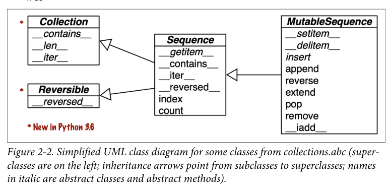
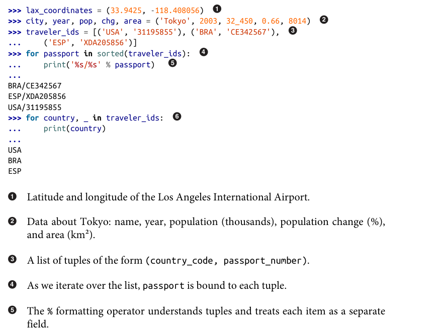

Every Python object in memory has a header with metadata. The
simplest Python object, a float, has a value field and two metadata
fields:

- ob_refcnt: the object’s reference count
- ob_type: a pointer to the object’s type
- ob_fval: a C double holding the value of the float

On a 64-bit Python build, each of those fields takes 8 bytes. That’s
why an array of floats is much more compact than a tuple of floats:
the array is a single object holding the raw values of the floats,
while the tuple consists of several objects—the tuple itself and each
float object contained in it.

It helps visualize how mutable sequences inherit all methods from immuta‐
ble sequences, and implement several additional methods. The built-in concrete
sequence types do not actually subclass the Sequence and MutableSequence abstract
base classes (ABCs), but they are virtual subclasses registered with those ABCs—as
we’ll see in Chapter 13. Being virtual subclasses, tuple and list pass these tests:

    from collections import abc
    issubclass(tuple, abc.Sequence)
    True
    issubclass(list, abc.MutableSequence)
    True

Another way of grouping sequence types is by mutability:
Mutable sequences
For example, list, bytearray, array.array, and collections.deque.
Immutable sequences
For example, tuple, str, and bytes.

When the last item in b is changed, b and a become different:

    a = (10, 'alpha', [1, 2])
    b = (10, 'alpha', [1, 2])
    a == b
    True
    b[-1].append(99)
    a == b
    False
    b
    (10, 'alpha', [1, 2, 99])
